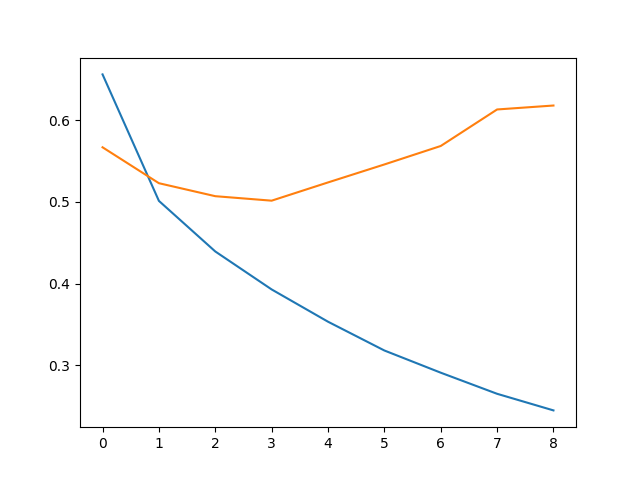

# 1. Training Results

**Classification Report on Validation Data (per-label F1 scores):**

| Label     | Precision | Recall | F1-score | Support |
|-----------|-----------|--------|----------|---------|
| sadness   | 0.84      | 0.87   | 0.85     | 24,339  |
| joy       | 0.85      | 0.84   | 0.84     | 28,269  |
| love      | 0.74      | 0.63   | 0.68     | 6,922   |
| anger     | 0.75      | 0.88   | 0.81     | 11,327  |
| fear      | 0.82      | 0.67   | 0.74     | 9,453   |
| surprise  | 0.63      | 0.67   | 0.65     | 3,052   |
|           |           |        |          |         |
| **accuracy** |         |        | **0.81** | 83,362  |
| **macro avg** | 0.77   | 0.76   | 0.76     | 83,362  |
| **weighted avg** | 0.81| 0.81   | 0.81     | 83,362  |

**Test F1-score:** 0.8108

**Confusion Matrix:**

---

# 2. Model Description

This model uses SBERT for extracting sentence embeddings and a feed-forward neural network for classification. The model is trained on a dataset with six emotion labels: *sadness, joy, love, anger, fear,* and *surprise*.

- **Training process:**
  - Data is loaded and preprocessed.
  - Sentence embeddings are extracted using a pretrained SBERT model.
  - A feed-forward neural network is trained using the AdamW optimizer (learning rate: 2e-5).
  - The model is evaluated on a validation set, achieving an overall accuracy of 81% and a macro F1 score of 0.76.
- **Key insight:**
  - Using pretrained embeddings captures semantic meaning more effectively than training from scratch, especially with limited resources.

---

# 3. Data Division

The dataset is sufficiently large and is randomly split into training, validation, and test sets:
- **Training set:** Used to train the model.
- **Validation set:** Used for hyperparameter tuning and evaluation during training.
- **Test set:** Used for final model evaluation.

---

# 4. Dataset Balance

The dataset is large but imbalanced; some classes have significantly more samples than others.

---

# 5. Result Analysis

- The model performs best on the *sadness* and *joy* classes (highest F1 scores).
- It struggles with the *love* and *surprise* classes (F1 score: 0.68), often confusing *love* with *sadness* and *joy*.
- *Anger* and *fear* are handled well, but *surprise* has the lowest support and is more difficult to classify.
- Techniques such as penalizing rare classes or duplicating their samples improve recall for those classes but do not significantly affect the overall F1 score.
- Training from scratch does not outperform using pretrained embeddings, likely due to the complexity of the task and dataset size.
- Trying different pretrained models does not yield significant improvements.
